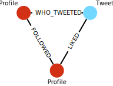

<h1 align="center">Neo4J - NestJS</h1>

This application is my first with Neo4J and I liked a lot, I implmented Neo4J with the repository pattern and it seems to work very well.

# My experience

My primary challenge was related to the formulation of queries and the organization of data. Due to a lack of utilization of a design tool, the process of structuring the data took an extended period, leading to a subsequent delay in the formulation of queries and the writing of code. This resulted in a substantial amount of time being consumed in making modifications to the code, as the queries were not compatible with the established structure.

# Structure

<p align="center">

</p>

# Application techonologies

- GraphQL
- NestJS
- Neo4J

# How to run the application

```
# Install dependencies
yarn

# Build the application
yarn build

# Start the application
yarn start
```

# Contact

You can contact me through https://www.linkedin.com/in/thalles-passos/
